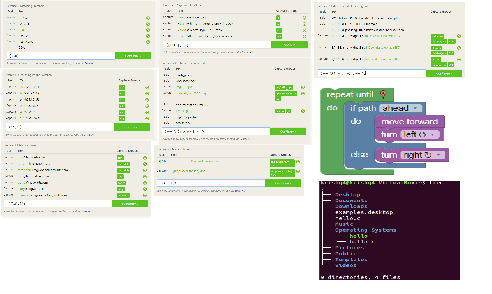
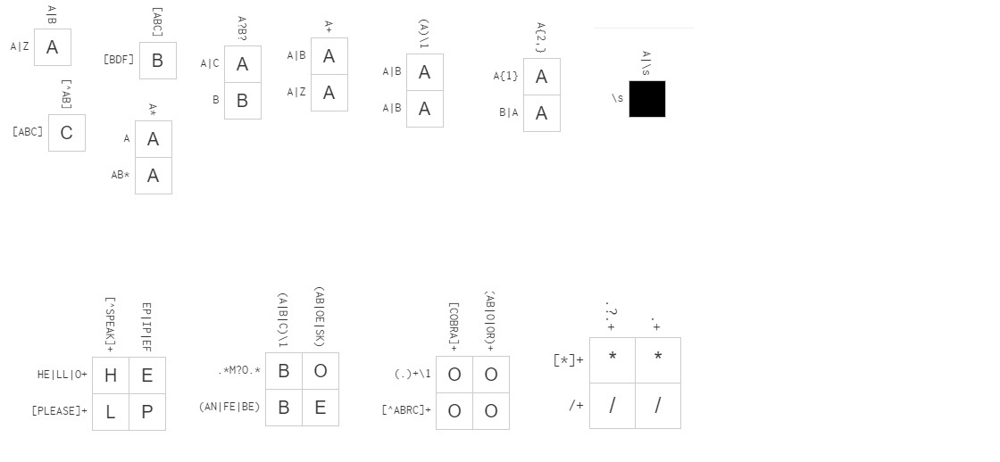

Chapter 3 Review:
  Well one thing I felt from reading this chapter was how outdated/abusable copyright law is. When copyright was first created, it was mostly used to protect physical assets, however with the creation of the internet and advancement of technology we can see a slow transition to more digital assets. The rising problem is that people then start to present their own interpretation of copyright law onto these situations, which leads to cases like this. Its a shame because due to this abuse people like Jesse can be essentially bullied out of their hard work. Work that could've caused a change.

Linux (Ubuntu) directory structure:

Regex Practice Problems/Blockly Problem:

Reflection:
  Looking through the open source projects, the one project that caught my interest was the Battle of Wesnoth project. My primary motivation was the fact that I actually played said game in the past, so seeing it as an open source project was a bit surreal for me. Moreover, skimming through the project page it seems they're using primarly C++ which would help me because since Data Structures I haven't used C++ for any practical projects so this could help me develop my skills further.

  As for today's lab, it was relatively straightforward yet thought provoking. The hardest part was the blocky puzzle due to the contraints that were implemented. Aside from that everything else was doable for sure.
