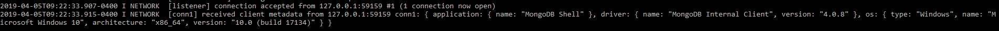
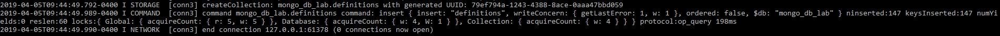
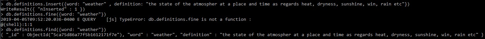
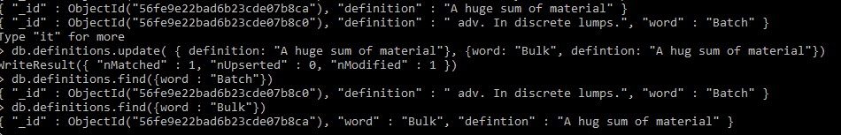
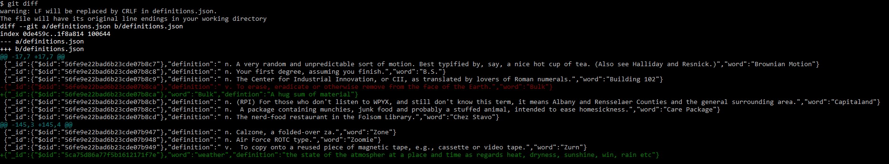
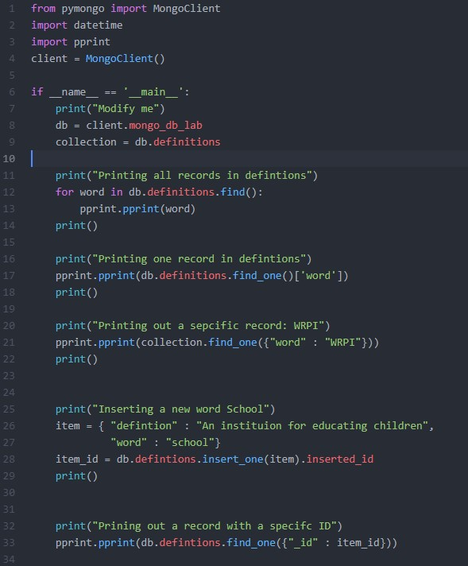
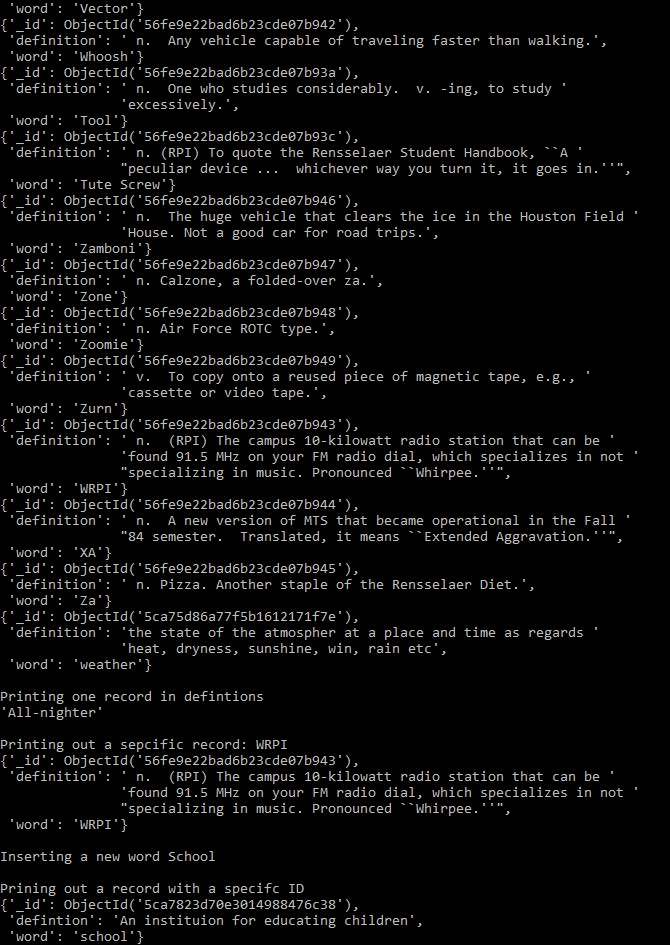
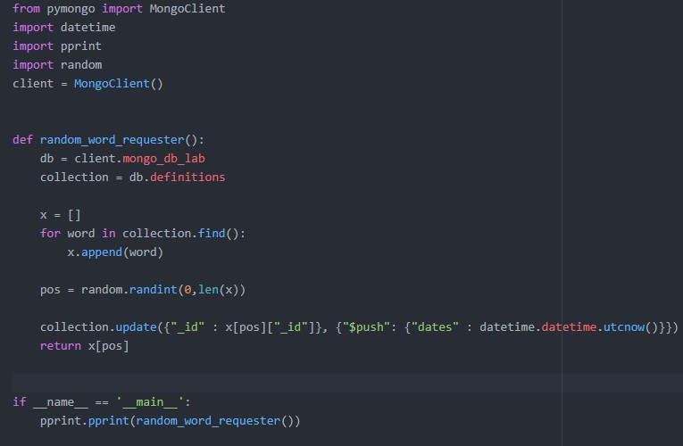
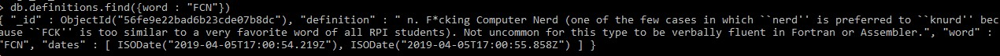

# Lab 10: MongoDB

## Checkpoint 1: Install MongoDB

### Proof of installation and Setup:

## Checkpoint 2: Load Some Data

### createCollection Message:

## Checkpoint 3: Basic Queries

### Results of Record entered

### Results of Record Changed

### Git Diff

## Checkpoint 4: Driving Queries

### Script

### PPrint Output

## Checkpoint 5: Random Word Requester

### Script

### Duplicate entry

