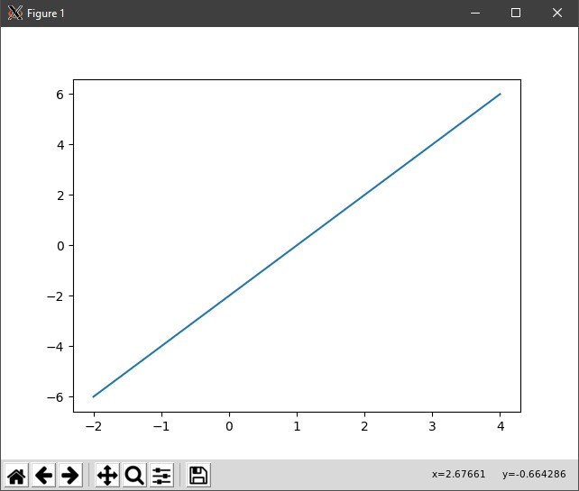
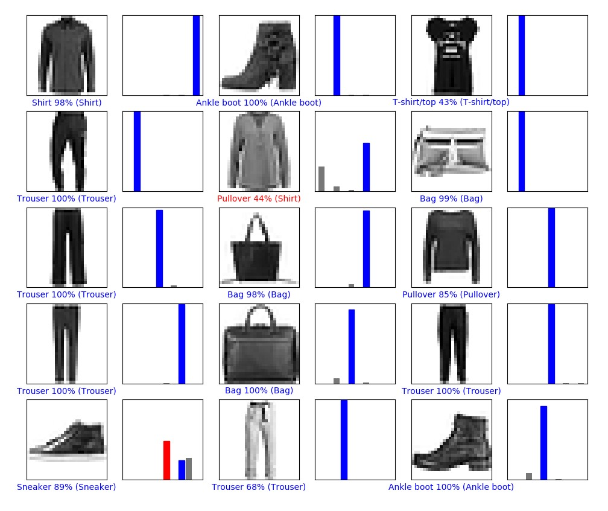
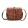
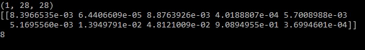
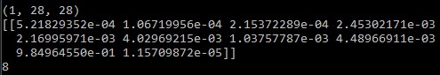
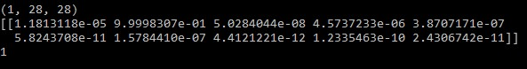

# Lab 11: TensorFlow

## Checkpoint 1: Verify Your TensorFlow

### Proof of setup:

## Checkpoint 2: Run a TensorFlow classification

### Proof of plot

## Checkpoint 3: Curate some Data

### Image 1:

### Image 2:

### Image 3:

