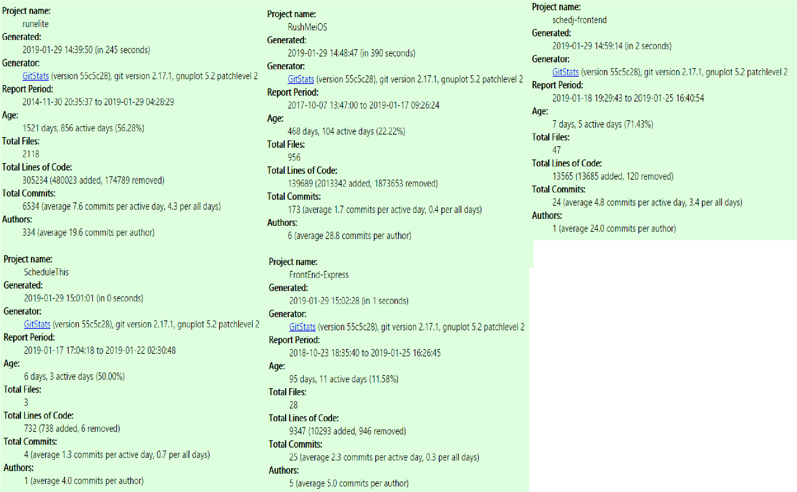
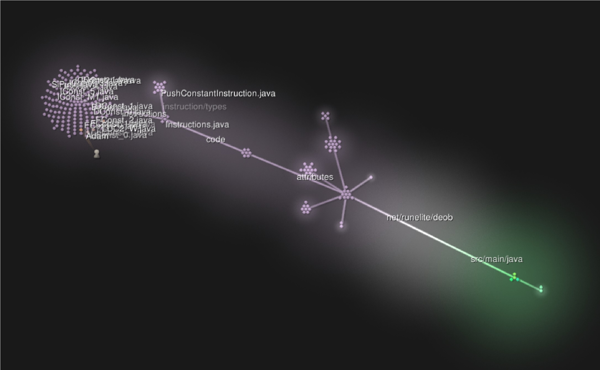
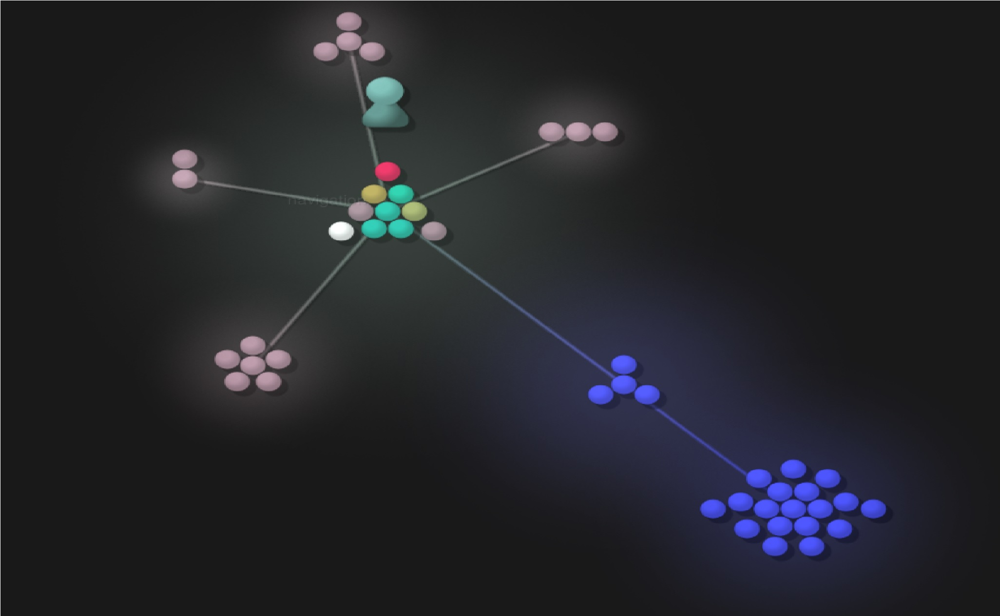
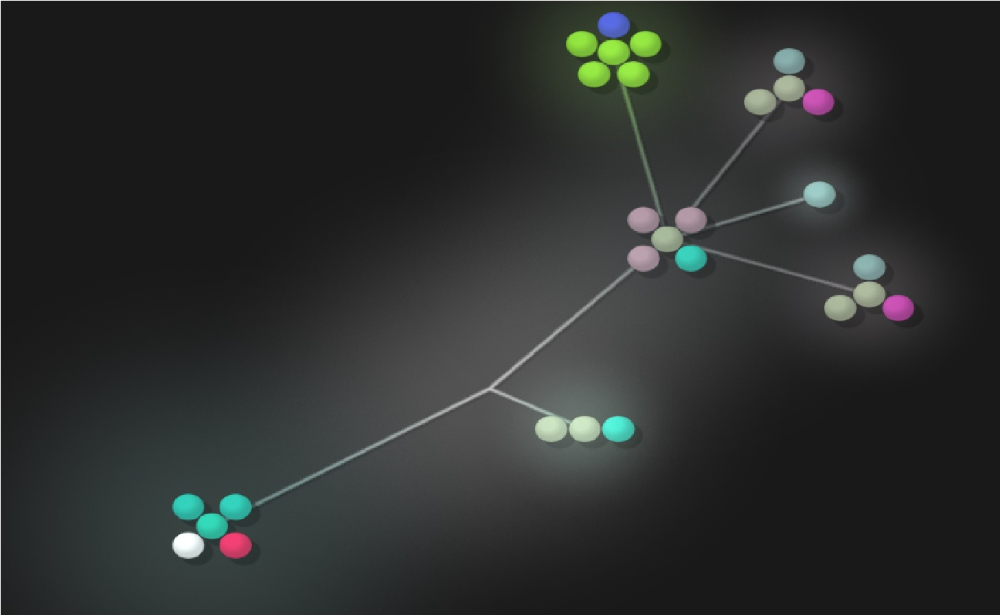
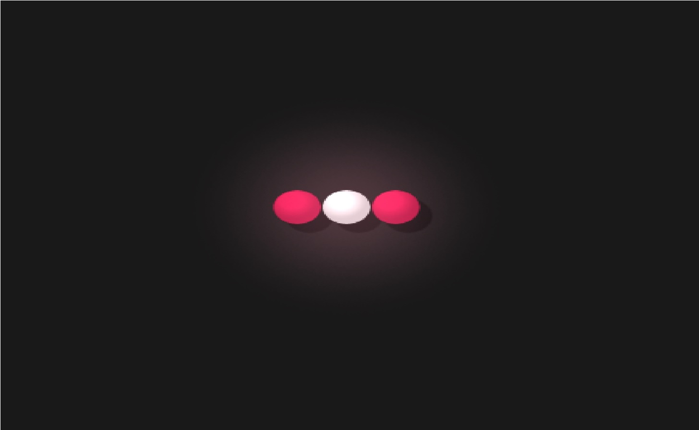
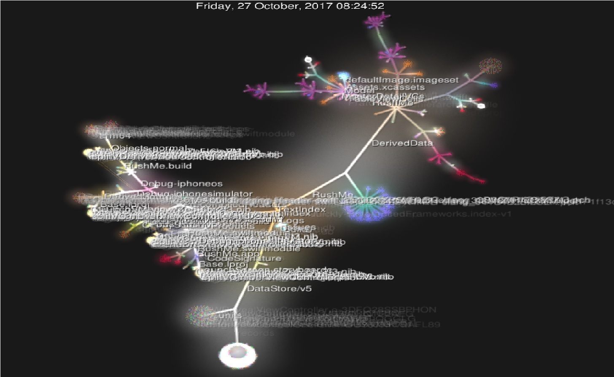

# RCOS Projects:

## Runelite:
 - Number of Contributors: 14
 - Number of lines of Code: 3187
 - The First Commit: Initial commit was on 02/04/18
 - The Latest Commit: Latest commit was 01/29/19 8 Hours ago
 - The Current Branches: master

## RushMe:
- Number of Contributors: 3
- Number of lines of Code: 138326
- The First Commit: Initial commit was on 02/04/18
- The Latest Commit: Latest commit was 01/06/19
- The Current Branches: Cam, Chat, ErrorSystem, NewLook, Notification, SaveFrats,
                        calendar, chages-jim, favorites, linted-version and master

## Schedj:
 - Number of Contributors: 2
 - Number of lines of Code: 13722
 - The First Commit: Initial commit was on 01/18/19
 - The Latest Commit: Latest commit was 01/25/19
 - The Current Branches: master

## ScheduleThis
- Number of Contributors: 1
- Number of lines of Code: 732
- The First Commit: Initial commit was on 01/17/19
- The Latest Commit: Latest commit was 01/22/19
- The Current Branches: master

## Second-String/FrontEnd-Express
- Number of Contributors: 3
- Number of lines of Code: 9768
- The First Commit: Initial commit was on 10/23/18
- The Latest Commit: Latest commit was 01/25/19
- The Current Branches: master, nick-statsheet, gfvandehei-homepage

## Using GitStats:
GitStats Image: 

Looking through the gitstats it's fairly clear that for most, if not all, of the projects, the stats taken via hand was way off compared to stats taken via gitstats

## Gource:

Runelite Gource Map: 
Schedj Gource Map: 
FrontEnd Gource Map: 
ScheduleThis Gource Map: 
RushMe Gource Map: 

# Unit Testing:

Link to code:

gibboa
drochecsp2017
