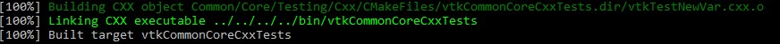
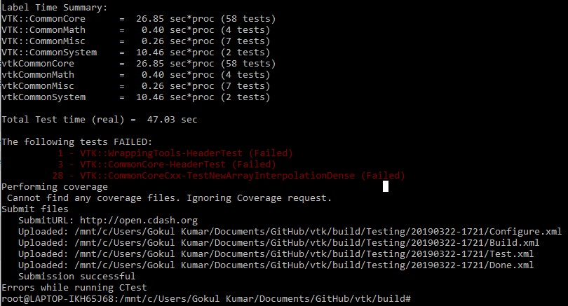
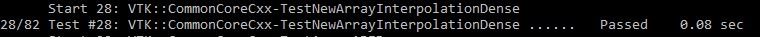

# Lab 8 WriteUp:

## CheckPoint 1: Getting Started

### VTK Build Systems:

## CheckPoint 2: Executing the Tests

### VTK Test Submission:

## CheckPoint 3: Adding a Test

### VTK Adding a Test -- Submission:

## CheckPoint 4: Fixing the Test

### VTK Fixing a Test -- Submission:

