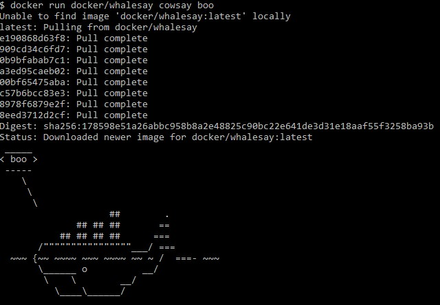
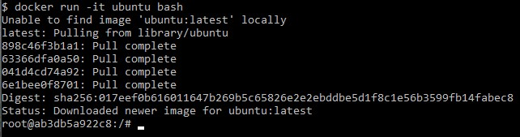
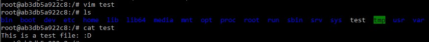
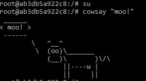
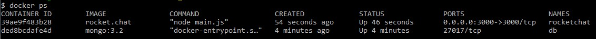
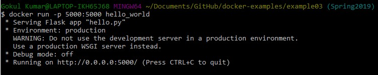
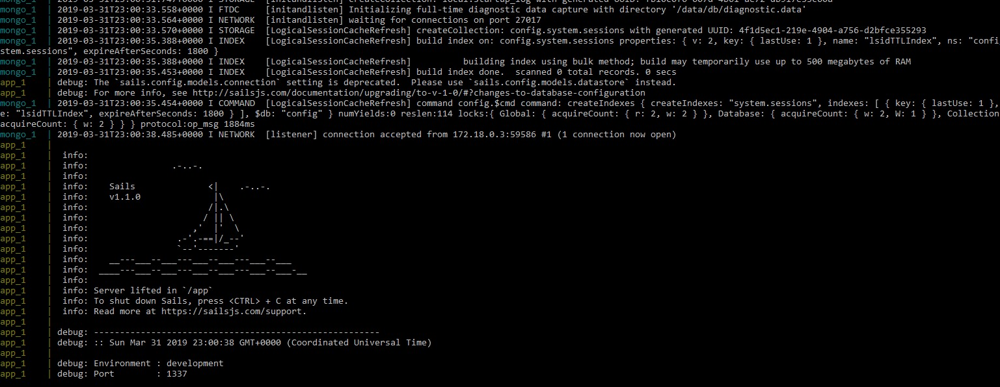

# Lab 9: Virtualization and Docker

## Docker Example #0: Installing Docker

### Testing your docker installation:

## Docker Example #1:Running Ubuntu in a Container

### Running the Ubuntu Container:

### Installing Vim:

### Installing Cowsay:

## Docker Example #2: Docker in Large Projects

### RocketChat:

-- NOTE: Due to issues with localhost I was not able to finish this part of the lab, therefore I've decided to just take a picture of the docker terminal

## Docker Example #3: Python Hello World Server with a Dockerfile

### Dockerfile

-- NOTE: Due to issues with localhost I was not able to finish this part of the lab, therefore I've decided to just take a picture of the Dockerfile

## Docker Example #4:

-- NOTE: Due to issues with localhost I was not able to finish this part of the lab, therefore I've decided to just take a picture of the server 
